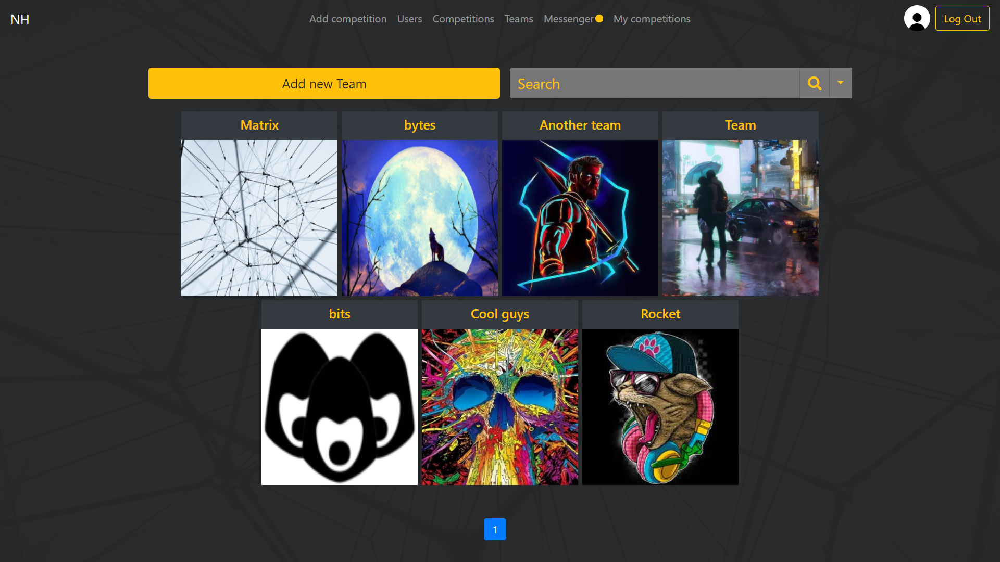

# NetCracker-Project
Проект является порталом для организации Хакатонов.  

Организатор может легко организовать новый хакатон:  
  
  
Можно посмотреть список соревнований, отфильтровать их как хочешь, по имени, по дате и т.д.:  
  
  
Кроме того, организатор может делать рассылку для всех участников или удалять команду
  
  
Пользователь может записаться на соревнование в составе какой-то команды.  
При подаче заявления на участие состав фиксируется и, если состав команды как-то изменится, на соревнование будут записаны всё те же люди.  
Также если в составе команды будет организатор этого соревнования, он не будет записан на соревнование  
  

На странице соревнования организатор может оценить участников, назначив победителя, команду, занявшую второе и третье место, а также того, кто был замечен спонсорами  

У пользователя есть свой профиль, где будет показана его статистика, команды в которых он состоит и соревнования в которых он участвовал или участвует в данный момент:  

Также можно искать команды, вступать в них и участвовать в их составе в хакатонах. Кроме того, тут же можно посмотреть статистику пользователя:  
  
  
Можно посмотреть профиль команды, текущий состав участников, а также ее статистику:  
  
  
Кроме того, можно посмотреть календарь соревнований: Общий, для команды и для пользователя, где будет наглядно видно пересечение графиков проведения, если оно есть:  
  
  
Кроме того, на портале есть мессенджер. Он нужен для того, чтобы люди могли общаться, образовывать команды или для получения какой-либо информации от организатора  
Чаты делятся на приватные (между двумя пользователями) и групповые (хакатона, команды или произвольные).  
Каждый может создать групповой чат, который не будет привязан к соревнованию или команде.  
Также тот, кто создал групповой чат, может удалять из него пользователей. Приглашать же их туда может каждый

  

Дополнительные возможности:  
Менять аватар пользователя, логотип команды:
  

Посмотреть список пользователей:
  

Посмотреть список соревнований, которые вы организовали: 
 - Архивные - те, что уже закончились
 - Текущие - те, которые либо еще не начались, либо в процессе
     