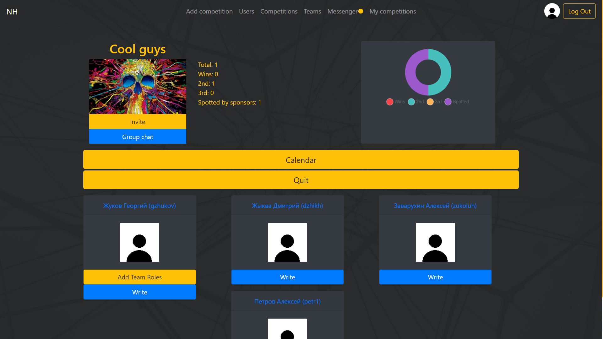

# NetCracker-Project
Проект является порталом для организации Хакатонов.  

Организатор может легко организовать новый хакатон:  
  
  
Можно посмотреть список соревнований, отфильтровать их как хочешь, по имени, по дате и т.д.:  
  
  
Кроме того, организатор может делать рассылку для всех участников или удалять команду
  
  
Пользователь может записаться на соревнование в составе какой-то команды.  
При подаче заявления на участие состав фиксируется и, если состав команды как-то изменится, на соревнование будут записаны всё те же люди.  
Также если в составе команды будет организатор этого соревнования, он не будет записан на соревнование  
  
  
У пользователя есть свой профиль, где будет показана его статистика, команды в которых он состоит и соревнования в которых он участвовал или участвует в данный момент:  
  
  
Также можно искать команды, вступать в них и участвовать в их составе в хакатонах:  
  
  
Можно посмотреть профиль команды, текущий состав участников, а также соревнования в которых участвовала эта команда:  
  
  
Кроме того, можно посмотреть календарь соревнований: Общий, для команды и для пользователя, где будет наглядно видно пересечение графиков проведения, если оно есть:  
  
  
Кроме того, на портале есть мессенджер. Он нужен для того, чтобы люди могли общаться, образовывать команды или для получения какой-либо информации от организатора  
